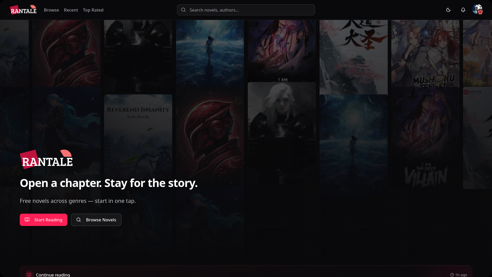

<!-- Placeholder logo: replace ./public/logo.png with your project logo -->
<p align="center">
  
</p>

# Rantale — RDKNovel Frontend

A modern Next.js 15 frontend for RDKNovel (Rantale): a novel-reading platform built with TypeScript, shadcn/ui, Tailwind CSS (OKLCH tokens), and a service-layered API client. This README explains how to get started, local development workflows, and the project structure.

> [!note]
> If a logo or screenshot is missing, add a file at `public/logo.png` and `public/hero.png` — placeholders are used above and below.

## Quick start

```bash
# Install
npm install

# Copy env and edit
cp .env.example .env.local
# Edit .env.local: set NEXT_PUBLIC_API_BASE_URL and NEXT_PUBLIC_APP_URL

# Dev server
npm run dev
```

Open http://localhost:3000

## Screenshots

<p align="center">
  
</p>

## Features

- Modern Next.js 15 App Router with React Server Components
- TypeScript-first codebase with strict types
- shadcn/ui components + Radix primitives and Lucide icons
- Dark/light theming via next-themes and CSS variables (OKLCH)
- Centralized, type-safe API client and service layer
- Auth: email/password, Google OAuth, JWT handling, protected routes
- Utility hooks for data fetching, pagination and optimistic updates

## Prerequisites

- Node.js 18+ (recommended)
- npm (or pnpm/yarn)
- A running backend API (Laravel/Sanctum or compatible)

## Environment

Create `.env.local` from `.env.example` and configure:

- NEXT_PUBLIC_API_BASE_URL — e.g. `http://localhost:8000/api/v1`
- NEXT_PUBLIC_APP_URL — e.g. `http://localhost:3000`

> [!warning]
> Do not commit secrets. Use `.env.local` for local development only.

## Scripts

- npm run dev — Development (Turbopack)
- npm run build — Production build
- npm run start — Start production server
- npm run lint — Run ESLint

## Project layout

```
src/
├─ app/              # Next.js App Router (layouts, pages, routes)
│  ├─ auth/          # login, register, oauth callbacks
│  ├─ layout.tsx     # Theme provider, global layout
│  └─ page.tsx       # Home
├─ components/       # UI components
│  └─ ui/            # shadcn/ui primitives and variants
├─ hooks/            # useAuth, useApi, useNovels, etc.
├─ lib/              # api-client, env validation, utils
├─ services/         # auth, novels, reading domain services
└─ types/            # shared TypeScript types
```

## API contract

The frontend expects a REST API with (typical) endpoints:

- POST /auth/register
- POST /auth/login
- GET /auth/me
- POST /auth/logout
- GET /auth/google
- GET /auth/google/callback
- CRUD endpoints under /novels, /chapters, /reading-progress

Adjust `NEXT_PUBLIC_API_BASE_URL` to point to your backend.

## Development notes

- Use `npx shadcn@latest add <component>` to scaffold UI components — they auto-configure with the project's components.json.
- Centralize domain logic in `src/services/*` and expose hooks from `src/hooks/*`.
- Use `cn()` helper from `src/lib/utils` for class merging and `cva` for component variants.

## Testing & linting

- ESLint is configured — run `npm run lint`.
- Add unit and integration tests as needed; no test runner configured by default.

## Deployment

Recommended: Vercel. Connect the repository and set environment variables in the Vercel dashboard.

Manual deploy (example):

```bash
npm run build
npm run start
```

## Replacing images / logo

- Logo: replace `public/logo.png` (160×160 recommended)
- Hero / screenshots: replace `public/hero.png` (900×auto recommended)

## Where to look next

- Environment and validation: `src/lib/env.ts`
- API client: `src/lib/api-client.ts`
- Authentication flow and services: `src/services/auth.ts`, `src/hooks/use-auth.ts`
- UI primitives and components: `src/components/ui/`

## Acknowledgements

Built with shadcn/ui, Tailwind CSS, Radix primitives, and Next.js.

---

If anything needs adjusting (more examples, diagrams, or a different tone), say which sections to expand and a logo/screenshot will be included. 
