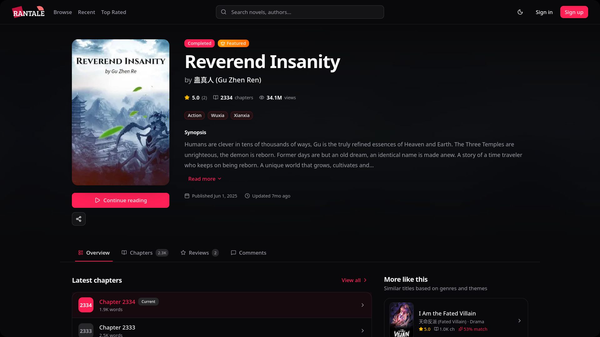
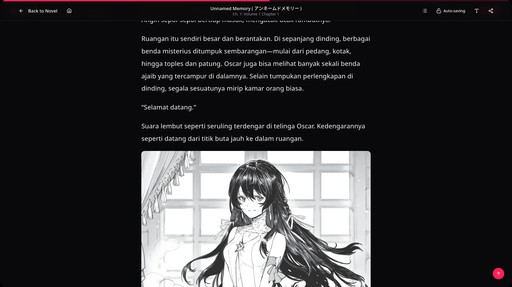

<p align="center">
  
</p>

# Rantale

Rantale is a modern novel reading platform frontend built with Next.js 15, TypeScript, Tailwind CSS, and shadcn/ui. It provides a polished discovery experience for browsing, filtering, and reading serialized stories, with authentication, author workflows, notifications, and a responsive reading-first interface.

## Overview

This project powers the public-facing web application for RDKNovel’s reading experience. It includes:

- a discovery-first landing page with featured and trending novels
- search, browse, and genre-based navigation
- user authentication and protected account flows
- reading progress tracking and continue-reading experiences
- author/admin surfaces for content management workflows
- a clean, theme-aware UI built on reusable components

## Screenshots

<p align="center">
  
</p>

<p align="center">
  
</p>

<p align="center">
  
</p>

## Features

- Next.js 15 App Router with server and client component patterns
- TypeScript-first architecture for predictable API and UI contracts
- shadcn/ui component system with Tailwind CSS and theme variables
- Dark and light mode support with CSS custom properties
- JWT-based authentication flow with protected routes and session state
- Rich reading experience with progress tracking, filtering, and recommendations
- Search and browse experiences that scale well for a growing catalog
- Vercel analytics and speed insights integration for production monitoring

## Tech stack

- Next.js 15
- React 19
- TypeScript
- Tailwind CSS v4
- shadcn/ui
- Radix UI primitives
- Lucide React icons
- next-themes
- Vercel Analytics / Speed Insights

## Prerequisites

Before you begin, make sure you have:

- Node.js 18+
- npm, pnpm, or yarn
- a running backend API that matches the frontend contract

## Quick start

1. Install dependencies:

   ```bash
   npm install
   ```

2. Copy the environment template:

   ```bash
   cp .env.example .env.local
   ```

3. Update the environment variables in `.env.local`:

   ```bash
   NEXT_PUBLIC_API_BASE_URL=http://localhost:8000/api
   NEXT_PUBLIC_APP_URL=http://localhost:3000
   NEXT_PUBLIC_SITE_URL=https://rantale.randk.me
   ```

4. Start the app in development mode:

   ```bash
   npm run dev
   ```

5. Open the app in your browser:

   ```text
   http://localhost:3000
   ```

> [!important]
> The frontend expects a compatible backend API. Update `NEXT_PUBLIC_API_BASE_URL` to the correct backend URL before running the app in a local or staging environment.

## Environment variables

The project uses environment variables for API connectivity and APP URL.

```bash
NEXT_PUBLIC_API_BASE_URL=http://localhost:8000/api
NEXT_PUBLIC_APP_URL=http://localhost:3000
```

See `.env.example` for the full template.

## Available scripts

```bash
npm run dev
npm run build
npm run start
npm run lint
npm run format
```

## Project structure

```text
frontend/
├─ .env.example
├─ .env.local
├─ components.json
├─ next.config.ts
├─ package.json
├─ public/
│  ├─ Hero.png
│  ├─ favicon.png
│  ├─ logo-dark.svg
│  ├─ logo-light.svg
│  ├─ rantale-dark.svg
│  └─ rantale-light.svg
├─ src/
│  ├─ app/
│  │  ├─ (auth)
│  │  ├─ (public)
│  │  ├─ api/
│  │  ├─ globals.css
│  │  ├─ layout.tsx
│  │  ├─ loading.tsx
│  │  └─ not-found.tsx
│  ├─ components/
│  ├─ contexts/
│  ├─ hooks/
│  ├─ lib/
│  ├─ services/
│  └─ types/
├─ eslint.config.mjs
├─ postcss.config.mjs
├─ tsconfig.json
└─ README.md
```

## Authentication and API layer

The frontend includes a centralized API client and typed service layer. Common flows include:

- registration and login
- session-based auth state
- JWT token handling and protected routes
- profile retrieval and account updates
- notification and reading-related API integrations

## Deployment

This app is designed for deployment on Vercel, but it can be hosted on any platform that supports Next.js.

### Vercel

1. Connect the repository to Vercel.
2. Set the environment variables from `.env.example`.
3. Deploy the app.

### Production build

```bash
npm run build
npm run start
```

> [!tip]
> For production, make sure `NEXT_PUBLIC_SITE_URL`, API base URLs, and all auth-related configuration are set to the correct live values.

## Development notes

- Use `src/services/*` for domain APIs and business logic.
- Keep UI composition in `src/components/*` and shared primitives in `src/components/ui/*`.
- Prefer `cn()` from `src/lib/utils` for class merging when composing component variants.
- Keep environment-specific settings out of source control by using `.env.local`.

## Contributing

This repository is intended for front-end development of the Rantale product. Contributions should follow the existing project structure and keep the user experience consistent with the current design system.

## Acknowledgements

Built with modern web tooling and open-source libraries, including Next.js, React, Tailwind CSS, shadcn/ui, and Radix UI.
